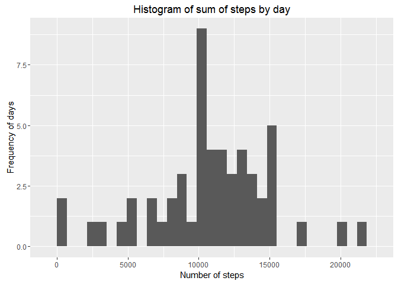
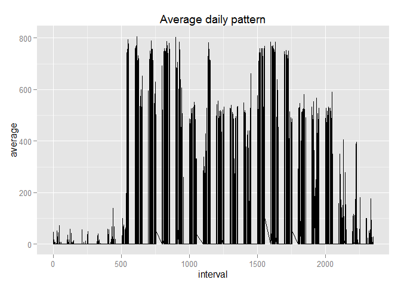
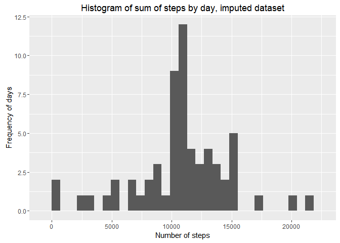
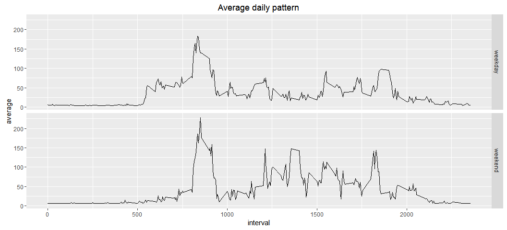
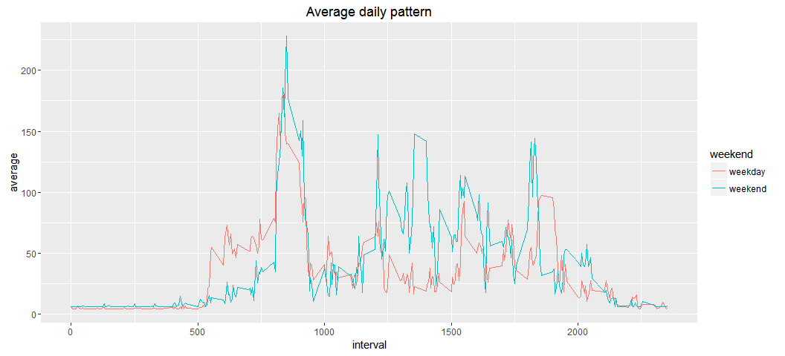

# Reproducible Research: Peer Assessment 1
#Summary

This is the markdown document for Reproducible Research Course at Coursera for participant Sami Ahma-aho.
Github:
https://github.com/samfield/RepData_PeerAssessment1.git


## Loading and preprocessing the data

I will use some basic packages for plotting and data handling, the following loads those packages:

```r
require(data.table)
```

```
## Loading required package: data.table
```

```r
require(dplyr)
```

```
## Loading required package: dplyr
## 
## Attaching package: 'dplyr'
## 
## The following objects are masked from 'package:data.table':
## 
##     between, last
## 
## The following objects are masked from 'package:stats':
## 
##     filter, lag
## 
## The following objects are masked from 'package:base':
## 
##     intersect, setdiff, setequal, union
```

```r
require(ggplot2)
```

```
## Loading required package: ggplot2
```

```r
require(lattice)
```

```
## Loading required package: lattice
```

It is assumed that the working directory of the user contains the same package of data as in the original repository, namely the activity.zip.

First we will load the data. By using the unzip command


```r
#directories;
#define the where the zip file is downloaded
temp <- paste(getwd(), "activity.zip", sep = "/")
#unzip the loaded file to the working directory then load a data.table with fread function
dt <- fread(unzip(temp), verbose = TRUE)
```

```
## Input contains no \n. Taking this to be a filename to open
## File opened, filesize is 0.000327 GB.
## Memory mapping ... ok
## Detected eol as \n only (no \r afterwards), the UNIX and Mac standard.
## Positioned on line 1 after skip or autostart
## This line is the autostart and not blank so searching up for the last non-blank ... line 1
## Detecting sep ... ','
## Detected 3 columns. Longest stretch was from line 1 to line 30
## Starting data input on line 1 (either column names or first row of data). First 10 characters: "steps","d
## All the fields on line 1 are character fields. Treating as the column names.
## Count of eol: 17569 (including 1 at the end)
## Count of sep: 35136
## nrow = MIN( nsep [35136] / ncol [3] -1, neol [17569] - nblank [1] ) = 17568
## Type codes (   first 5 rows): 041
## Type codes (+ middle 5 rows): 141
## Type codes (+   last 5 rows): 141
## Type codes: 141 (after applying colClasses and integer64)
## Type codes: 141 (after applying drop or select (if supplied)
## Allocating 3 column slots (3 - 0 dropped)
## Read 17568 rows. Exactly what was estimated and allocated up front
##    0.000s (  0%) Memory map (rerun may be quicker)
##    0.000s (  0%) sep and header detection
##    0.001s ( 17%) Count rows (wc -l)
##    0.000s (  0%) Column type detection (first, middle and last 5 rows)
##    0.000s (  0%) Allocation of 17568x3 result (xMB) in RAM
##    0.005s ( 83%) Reading data
##    0.000s (  0%) Allocation for type bumps (if any), including gc time if triggered
##    0.000s (  0%) Coercing data already read in type bumps (if any)
##    0.000s (  0%) Changing na.strings to NA
##    0.006s        Total
```

```r
#turn date as a date variable
dt[,date:=as.Date(date, "%Y-%m-%d")]
#turn steps to numeric
dt[,steps:=as.numeric(steps)]
#the summary for our data is 
summary(dt)
```

```
##      steps             date               interval     
##  Min.   :  0.00   Min.   :2012-10-01   Min.   :   0.0  
##  1st Qu.:  0.00   1st Qu.:2012-10-16   1st Qu.: 588.8  
##  Median :  0.00   Median :2012-10-31   Median :1177.5  
##  Mean   : 37.38   Mean   :2012-10-31   Mean   :1177.5  
##  3rd Qu.: 12.00   3rd Qu.:2012-11-15   3rd Qu.:1766.2  
##  Max.   :806.00   Max.   :2012-11-30   Max.   :2355.0  
##  NA's   :2304
```

## What is mean total number of steps taken per day?

__Sum of steps per day__


```r
#calculation of sum of steps per day, removing na values, but reporting whole days with no values
dt[,.(sum_steps=sum(steps, na.rm = TRUE)), by=date]
```

```
##           date sum_steps
##  1: 2012-10-01         0
##  2: 2012-10-02       126
##  3: 2012-10-03     11352
##  4: 2012-10-04     12116
##  5: 2012-10-05     13294
##  6: 2012-10-06     15420
##  7: 2012-10-07     11015
##  8: 2012-10-08         0
##  9: 2012-10-09     12811
## 10: 2012-10-10      9900
## 11: 2012-10-11     10304
## 12: 2012-10-12     17382
## 13: 2012-10-13     12426
## 14: 2012-10-14     15098
## 15: 2012-10-15     10139
## 16: 2012-10-16     15084
## 17: 2012-10-17     13452
## 18: 2012-10-18     10056
## 19: 2012-10-19     11829
## 20: 2012-10-20     10395
## 21: 2012-10-21      8821
## 22: 2012-10-22     13460
## 23: 2012-10-23      8918
## 24: 2012-10-24      8355
## 25: 2012-10-25      2492
## 26: 2012-10-26      6778
## 27: 2012-10-27     10119
## 28: 2012-10-28     11458
## 29: 2012-10-29      5018
## 30: 2012-10-30      9819
## 31: 2012-10-31     15414
## 32: 2012-11-01         0
## 33: 2012-11-02     10600
## 34: 2012-11-03     10571
## 35: 2012-11-04         0
## 36: 2012-11-05     10439
## 37: 2012-11-06      8334
## 38: 2012-11-07     12883
## 39: 2012-11-08      3219
## 40: 2012-11-09         0
## 41: 2012-11-10         0
## 42: 2012-11-11     12608
## 43: 2012-11-12     10765
## 44: 2012-11-13      7336
## 45: 2012-11-14         0
## 46: 2012-11-15        41
## 47: 2012-11-16      5441
## 48: 2012-11-17     14339
## 49: 2012-11-18     15110
## 50: 2012-11-19      8841
## 51: 2012-11-20      4472
## 52: 2012-11-21     12787
## 53: 2012-11-22     20427
## 54: 2012-11-23     21194
## 55: 2012-11-24     14478
## 56: 2012-11-25     11834
## 57: 2012-11-26     11162
## 58: 2012-11-27     13646
## 59: 2012-11-28     10183
## 60: 2012-11-29      7047
## 61: 2012-11-30         0
##           date sum_steps
```

__Total number of steps daily__


```r
#plotting total number of steps daily
#the data is a steps by dates
ggplot(data=dt[is.na(steps)==FALSE,.(sum_of_steps=sum(steps, na.rm = TRUE)), by=date], aes(sum_of_steps)) + geom_histogram() +xlab("Number of steps") +ylab("Frequency of days") +ggtitle("Histogram of sum of steps by day")
```

```
## `stat_bin()` using `bins = 30`. Pick better value with `binwidth`.
```

 

__Mean and median steps for total steps per day__


```r
#calculation of mean of steps for total sum of steps per day
dt[,.(sum_steps=sum(steps, na.rm = TRUE)), by=date][,.(steps_mean=mean(sum_steps, na.rm = TRUE))]
```

```
##    steps_mean
## 1:    9354.23
```

```r
#calculation of median of steps per day
dt[,.(sum_steps=sum(steps, na.rm = TRUE)), by=date][,.(steps_median=median(sum_steps, na.rm = TRUE))]
```

```
##    steps_median
## 1:        10395
```


## What is the average daily activity pattern?

__Time series of average daily activity__


```r
#make the plot of average daily activity
ggplot(data=dt[is.na(steps)==FALSE,.(average=mean(steps, na.rm = TRUE)), by=.(interval)],aes(x=interval,y=average)) + geom_line() +ggtitle("Average daily pattern")
```

 


__Maximum steps averaged over days(of interval)__


```r
dt[is.na(steps)==FALSE,.(average=mean(steps, na.rm = TRUE)),by=.(interval)][,max(average)]
```

```
## [1] 206.1698
```


__The interval of maximum amount of steps__


```r
dt[is.na(steps)==FALSE,.(average=mean(steps, na.rm = TRUE)),by=.(interval)][max(average),interval]
```

```
## [1] 1705
```


## Imputing missing values

###Reporting missing values per steps,date and interval 


```r
#missing values for steps
dt[is.na(steps)==TRUE,.N]
```

```
## [1] 2304
```

```r
#missing values for date
dt[is.na(date)==TRUE,.N]
```

```
## [1] 0
```

```r
#missing values for interval
dt[is.na(interval)==TRUE,.N]
```

```
## [1] 0
```

Total of 2304 missing values.

Missing values are imputed with the mean of the series.


```r
#create a new dataset
#impute mean steps by mean of day
dt_impute <- dt
mean_steps <- mean(dt$steps, na.rm = TRUE)
dt_impute[is.na(steps)==TRUE,steps:=mean_steps]
```

__Histogram for the imputed series__


```r
ggplot(data=dt_impute[is.na(steps)==FALSE,.(sum_of_steps=sum(steps, na.rm = TRUE)), by=date], aes(sum_of_steps)) + geom_histogram() +xlab("Number of steps") +ylab("Frequency of days") +ggtitle("Histogram of sum of steps by day, imputed dataset")
```

```
## `stat_bin()` using `bins = 30`. Pick better value with `binwidth`.
```

 

__Comparison between original and imputed datasets - Mean and median steps for total steps per day__


```r
#calculation of mean of steps for total sum of steps per day
dt_impute[,.(sum_steps=sum(steps, na.rm = TRUE)), by=date][,.(steps_mean=mean(sum_steps, na.rm = TRUE))]
```

```
##    steps_mean
## 1:   10766.19
```

```r
#calculation of median of steps per day
dt_impute[,.(sum_steps=sum(steps, na.rm = TRUE)), by=date][,.(steps_median=median(sum_steps, na.rm = TRUE))]
```

```
##    steps_median
## 1:     10766.19
```

The values of mean and median for the imputed series differ from the original series. The median and mean are the same after imputation.

## Are there differences in activity patterns between weekdays and weekends?


```r
#lets use the data.table function for weekdays 
#calculate what day of the week the obs is
dt_impute[,weekday:=as.POSIXlt(date)$wday +1L]
#check
dt_impute
```

```
##          steps       date interval weekday
##     1: 37.3826 2012-10-01        0       2
##     2: 37.3826 2012-10-01        5       2
##     3: 37.3826 2012-10-01       10       2
##     4: 37.3826 2012-10-01       15       2
##     5: 37.3826 2012-10-01       20       2
##    ---                                    
## 17564: 37.3826 2012-11-30     2335       6
## 17565: 37.3826 2012-11-30     2340       6
## 17566: 37.3826 2012-11-30     2345       6
## 17567: 37.3826 2012-11-30     2350       6
## 17568: 37.3826 2012-11-30     2355       6
```

```r
#turn as a factor variable
dt_impute[weekday <6, weekend:="weekday"]
dt_impute[weekday >5, weekend:="weekend"]
dt_impute[,weekend:=as.factor(weekend)]
```


```r
#the plot requested
ggplot(data=dt_impute[,.(average=mean(steps, na.rm = TRUE)), by=.(interval,weekend)],aes(x=interval,y=average)) + geom_line() +ggtitle("Average daily pattern") + facet_grid(weekend~.)
```

 

```r
#a better plot for comparing differences
ggplot() + geom_line(data=dt_impute[,.(average=mean(steps, na.rm = TRUE)), by=.(interval,weekend)],aes(x=interval,y=average, color=weekend)) +ggtitle("Average daily pattern")
```

 

