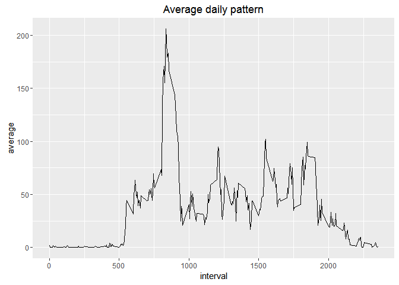

# Reproducible Research: Peer Assessment 1
#Summary

This is the markdown document for Reproducible Research Course at Coursera for participant Sami Ahma-aho.
Github:
https://github.com/samfield/RepData_PeerAssessment1.git


## Loading and preprocessing the data

I will use some basic packages for plotting and data handling, the following loads those packages:

```r
require(data.table)
```

```
## Loading required package: data.table
```

```r
require(dplyr)
```

```
## Loading required package: dplyr
## 
## Attaching package: 'dplyr'
## 
## The following objects are masked from 'package:data.table':
## 
##     between, last
## 
## The following objects are masked from 'package:stats':
## 
##     filter, lag
## 
## The following objects are masked from 'package:base':
## 
##     intersect, setdiff, setequal, union
```

```r
require(ggplot2)
```

```
## Loading required package: ggplot2
```

It is assumed that the working directory of the user contains the same package of data as in the original repository, namely the activity.zip.

First we will load the data. By using the unzip command

```r
#directories;
#define the where the zip file is downloaded
temp <- paste(getwd(), "activity.zip", sep = "/")
#unzip the loaded file to the working directory then load a data.table with fread function
dt <- fread(unzip(temp), verbose = TRUE)
```

```
## Input contains no \n. Taking this to be a filename to open
## File opened, filesize is 0.000327 GB.
## Memory mapping ... ok
## Detected eol as \n only (no \r afterwards), the UNIX and Mac standard.
## Positioned on line 1 after skip or autostart
## This line is the autostart and not blank so searching up for the last non-blank ... line 1
## Detecting sep ... ','
## Detected 3 columns. Longest stretch was from line 1 to line 30
## Starting data input on line 1 (either column names or first row of data). First 10 characters: "steps","d
## All the fields on line 1 are character fields. Treating as the column names.
## Count of eol: 17569 (including 1 at the end)
## Count of sep: 35136
## nrow = MIN( nsep [35136] / ncol [3] -1, neol [17569] - nblank [1] ) = 17568
## Type codes (   first 5 rows): 041
## Type codes (+ middle 5 rows): 141
## Type codes (+   last 5 rows): 141
## Type codes: 141 (after applying colClasses and integer64)
## Type codes: 141 (after applying drop or select (if supplied)
## Allocating 3 column slots (3 - 0 dropped)
## Read 17568 rows. Exactly what was estimated and allocated up front
##    0.000s (  0%) Memory map (rerun may be quicker)
##    0.000s (  0%) sep and header detection
##    0.000s (  0%) Count rows (wc -l)
##    0.000s (  0%) Column type detection (first, middle and last 5 rows)
##    0.000s (  0%) Allocation of 17568x3 result (xMB) in RAM
##    0.000s (  0%) Reading data
##    0.000s (  0%) Allocation for type bumps (if any), including gc time if triggered
##    0.000s (  0%) Coercing data already read in type bumps (if any)
##    0.000s (  0%) Changing na.strings to NA
##    0.001s        Total
```

```r
#turn date as a date variable
dt[,date:=as.Date(date, "%Y-%m-%d")]
#turn steps to numeric
dt[,steps:=as.numeric(steps)]
#the summary for our data is 
summary(dt)
```

```
##      steps             date               interval     
##  Min.   :  0.00   Min.   :2012-10-01   Min.   :   0.0  
##  1st Qu.:  0.00   1st Qu.:2012-10-16   1st Qu.: 588.8  
##  Median :  0.00   Median :2012-10-31   Median :1177.5  
##  Mean   : 37.38   Mean   :2012-10-31   Mean   :1177.5  
##  3rd Qu.: 12.00   3rd Qu.:2012-11-15   3rd Qu.:1766.2  
##  Max.   :806.00   Max.   :2012-11-30   Max.   :2355.0  
##  NA's   :2304
```


## What is mean total number of steps taken per day?


```
##           date mean_steps
##  1: 2012-10-01        NaN
##  2: 2012-10-02  0.4375000
##  3: 2012-10-03 39.4166667
##  4: 2012-10-04 42.0694444
##  5: 2012-10-05 46.1597222
##  6: 2012-10-06 53.5416667
##  7: 2012-10-07 38.2465278
##  8: 2012-10-08        NaN
##  9: 2012-10-09 44.4826389
## 10: 2012-10-10 34.3750000
## 11: 2012-10-11 35.7777778
## 12: 2012-10-12 60.3541667
## 13: 2012-10-13 43.1458333
## 14: 2012-10-14 52.4236111
## 15: 2012-10-15 35.2048611
## 16: 2012-10-16 52.3750000
## 17: 2012-10-17 46.7083333
## 18: 2012-10-18 34.9166667
## 19: 2012-10-19 41.0729167
## 20: 2012-10-20 36.0937500
## 21: 2012-10-21 30.6284722
## 22: 2012-10-22 46.7361111
## 23: 2012-10-23 30.9652778
## 24: 2012-10-24 29.0104167
## 25: 2012-10-25  8.6527778
## 26: 2012-10-26 23.5347222
## 27: 2012-10-27 35.1354167
## 28: 2012-10-28 39.7847222
## 29: 2012-10-29 17.4236111
## 30: 2012-10-30 34.0937500
## 31: 2012-10-31 53.5208333
## 32: 2012-11-01        NaN
## 33: 2012-11-02 36.8055556
## 34: 2012-11-03 36.7048611
## 35: 2012-11-04        NaN
## 36: 2012-11-05 36.2465278
## 37: 2012-11-06 28.9375000
## 38: 2012-11-07 44.7326389
## 39: 2012-11-08 11.1770833
## 40: 2012-11-09        NaN
## 41: 2012-11-10        NaN
## 42: 2012-11-11 43.7777778
## 43: 2012-11-12 37.3784722
## 44: 2012-11-13 25.4722222
## 45: 2012-11-14        NaN
## 46: 2012-11-15  0.1423611
## 47: 2012-11-16 18.8923611
## 48: 2012-11-17 49.7881944
## 49: 2012-11-18 52.4652778
## 50: 2012-11-19 30.6979167
## 51: 2012-11-20 15.5277778
## 52: 2012-11-21 44.3993056
## 53: 2012-11-22 70.9270833
## 54: 2012-11-23 73.5902778
## 55: 2012-11-24 50.2708333
## 56: 2012-11-25 41.0902778
## 57: 2012-11-26 38.7569444
## 58: 2012-11-27 47.3819444
## 59: 2012-11-28 35.3576389
## 60: 2012-11-29 24.4687500
## 61: 2012-11-30        NaN
##           date mean_steps
```

```
##           date median_steps
##  1: 2012-10-01           NA
##  2: 2012-10-02            0
##  3: 2012-10-03            0
##  4: 2012-10-04            0
##  5: 2012-10-05            0
##  6: 2012-10-06            0
##  7: 2012-10-07            0
##  8: 2012-10-08           NA
##  9: 2012-10-09            0
## 10: 2012-10-10            0
## 11: 2012-10-11            0
## 12: 2012-10-12            0
## 13: 2012-10-13            0
## 14: 2012-10-14            0
## 15: 2012-10-15            0
## 16: 2012-10-16            0
## 17: 2012-10-17            0
## 18: 2012-10-18            0
## 19: 2012-10-19            0
## 20: 2012-10-20            0
## 21: 2012-10-21            0
## 22: 2012-10-22            0
## 23: 2012-10-23            0
## 24: 2012-10-24            0
## 25: 2012-10-25            0
## 26: 2012-10-26            0
## 27: 2012-10-27            0
## 28: 2012-10-28            0
## 29: 2012-10-29            0
## 30: 2012-10-30            0
## 31: 2012-10-31            0
## 32: 2012-11-01           NA
## 33: 2012-11-02            0
## 34: 2012-11-03            0
## 35: 2012-11-04           NA
## 36: 2012-11-05            0
## 37: 2012-11-06            0
## 38: 2012-11-07            0
## 39: 2012-11-08            0
## 40: 2012-11-09           NA
## 41: 2012-11-10           NA
## 42: 2012-11-11            0
## 43: 2012-11-12            0
## 44: 2012-11-13            0
## 45: 2012-11-14           NA
## 46: 2012-11-15            0
## 47: 2012-11-16            0
## 48: 2012-11-17            0
## 49: 2012-11-18            0
## 50: 2012-11-19            0
## 51: 2012-11-20            0
## 52: 2012-11-21            0
## 53: 2012-11-22            0
## 54: 2012-11-23            0
## 55: 2012-11-24            0
## 56: 2012-11-25            0
## 57: 2012-11-26            0
## 58: 2012-11-27            0
## 59: 2012-11-28            0
## 60: 2012-11-29            0
## 61: 2012-11-30           NA
##           date median_steps
```

```
## stat_bin: binwidth defaulted to range/30. Use 'binwidth = x' to adjust this.
```

 


## What is the average daily activity pattern?


```r
#make the plot of average daily activity
ggplot(data=dt[is.na(steps)==FALSE,.(average=mean(steps, na.rm = TRUE)), by=.(date,interval)],aes(x=interval,y=average)) + geom_line() +ggtitle("Average daily pattern")
```

 

```r
#maximum steps averaged over days(of interval)
dt[is.na(steps)==FALSE,.(average=mean(steps, na.rm = TRUE)),by=.(date,interval)][,max(average)]
```

```
## [1] 806
```

```r
#the date of maximum amount of steps
dt[is.na(steps)==FALSE,.(average=mean(steps, na.rm = TRUE)),by=.(date,interval)][max(average),date]
```

```
## [1] "2012-10-04"
```


## Imputing missing values


## Are there differences in activity patterns between weekdays and weekends?
